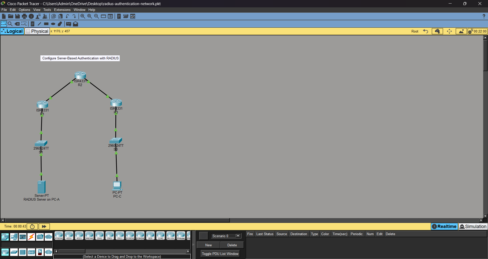

# radius-authentication-network
Simulation of network authentication using RADIUS in Cisco Packet Tracer
Features
- Configured routers and switches
- Set up RADIUS-based authentication
- Tested secure access between network devices

Network Topology

 Technologies
- Cisco Packet Tracer
- Networking (Routing & Switching)
- AAA (Authentication, Authorization, Accounting)
